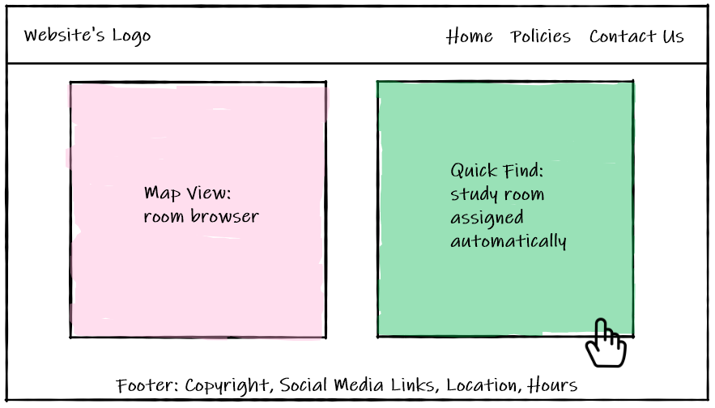
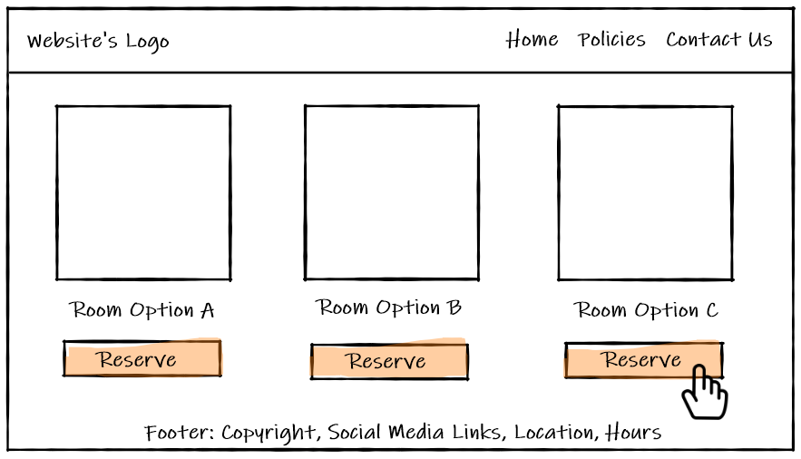
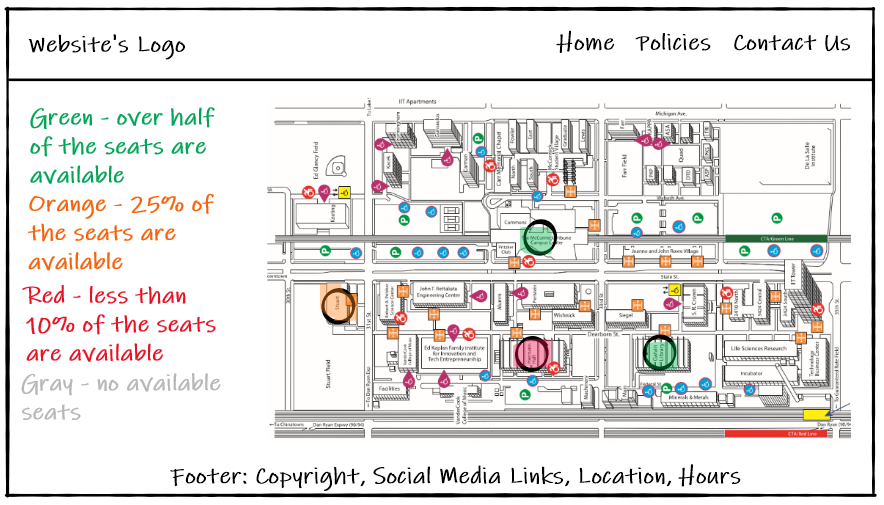
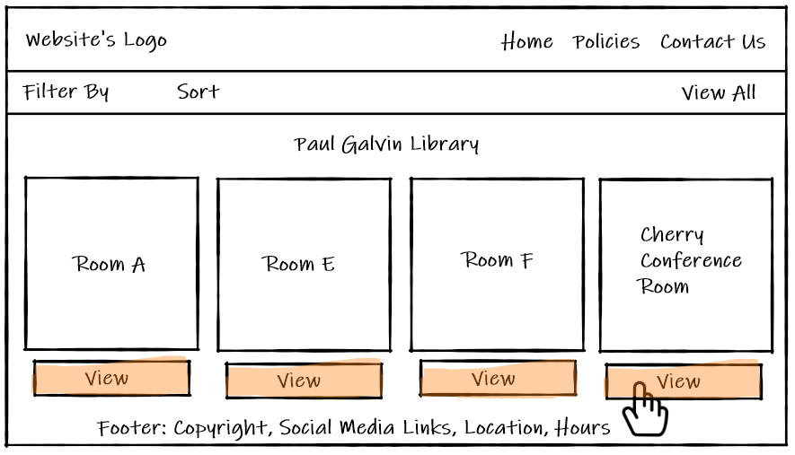
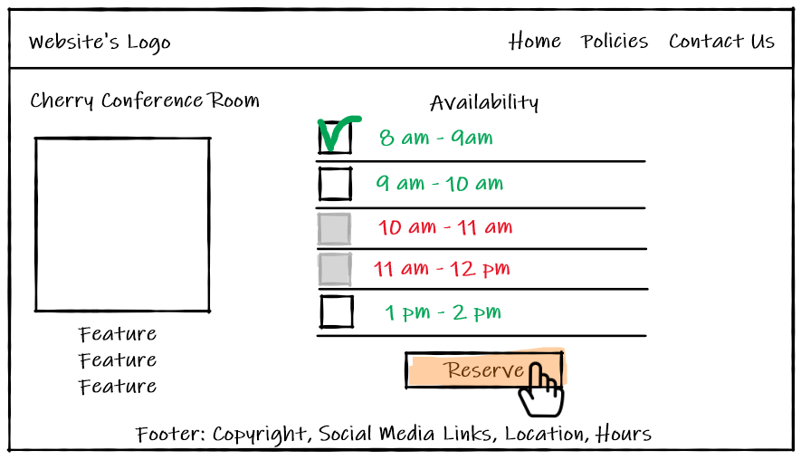
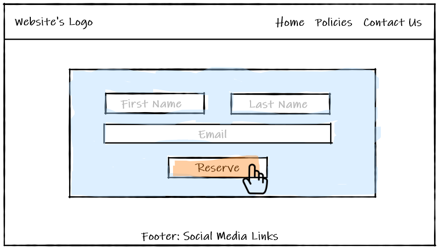
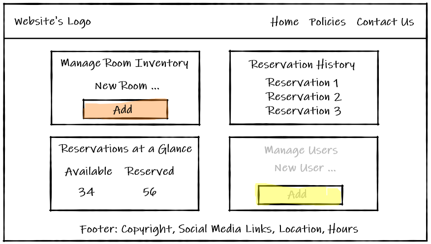

# IPRO 497

This is a repository for an IPRO 497 project. For this project we are developing a study room reservation website.

Link to the site: https://ipro-497-spring-2021-team-g.github.io/StudyRoomReservationWebApp/

## Team G

* **Zhuohui Deng** - Senior, CS
* **Yifan Huang** - Junior, CS 
* **Yulia Thonippara** - Senior, ITM

## Problem Statements

### Statement #1

IIT students need a quick and efficient method to find available study spaces on and off campus without wasting time on checking availability of each individual room. Saved time will allow students to allocate more time to studying.

### Statement #2
COVID-19 imposed an extra burden on IIT students to find suitable individual or small group study spaces that comply with the university social distancing requirements. On the other hand, the university administration needs to stay in compliance with the CDC and city of Chicago social distancing policies and ensure the facility occupancy rates of less than 25% at any given time.

## Personas

**Shruti** is an international student from India majoring in Information Technology and Management at Illinois Tech. Shruti is a senior and her last year in college is very demanding. A lot of Shruti’s assignments are group projects. As a project manager for one of her group assignments, Shruti is required to reserve a study space which the team can use for collaboration.

**Andrew** Andrew is a commuter student majoring in Computer Science at Illinois Tech. He lives in Wheaton, IL , the suburb of Chicago, and commutes to campus three days a week. Andrew also works part-time while attending college. He is trying to manage his time efficiently and maximize the time when he is on campus to complete his homework assignments. Andrew would like to have study space reservation system that would show available spots within seconds.

**Christina** Christina is a facilities manager at Illinois Tech. In the wake of the COVID 19 pandemic, Christina is tasked with staying in complaince with the city of Chicago and the CDC social distancing guidelines. She would like to have a working application that would help her to add and remove to the available study space inventory, track reservation history, and peak reservation times.

## Scenarios

### Scenario #1

It’s already final week, Henry needs to maximize his time to study so that he may get a better score. And he thinks the library is the perfect place for reviewing. But before this year, he has to go to the library in person to check whether there are vacant tables for him to use. This is time consuming for Henry because he has to walk through the Galvin library to check every single room. If he is unable to find a vacant room, it results in him wasting valuable time that can be allocated for studying. Luckily, with the use of the app, Henry can just take a loop on the seat map to see if there are vacant tables and reserve them with just a click.

### Scenario #2
Christina is a student who is working in the library, and the whole 2020 is a disaster for her because she needed to make sure that  the students who were studying in the library kept social distance. But now, she only needs to ask the other faculties in the library to set the seat in advance and send the seat map in the app. The seats are fixed and limited in each study room so she will never worry about the student breaking social distance rules in the group discussion. And for those people who want to renew the study place, she doesn’t need to go to their place and asks them in person, the only thing she needs to do is checking the app and see who sent the renew requests and then approves it.

## Website Wireframe

Quick Find: "randomly" assigns a seat once this option is clicked. We will always assign the seats in the buildings which are almost full (in our case, the red ones).

